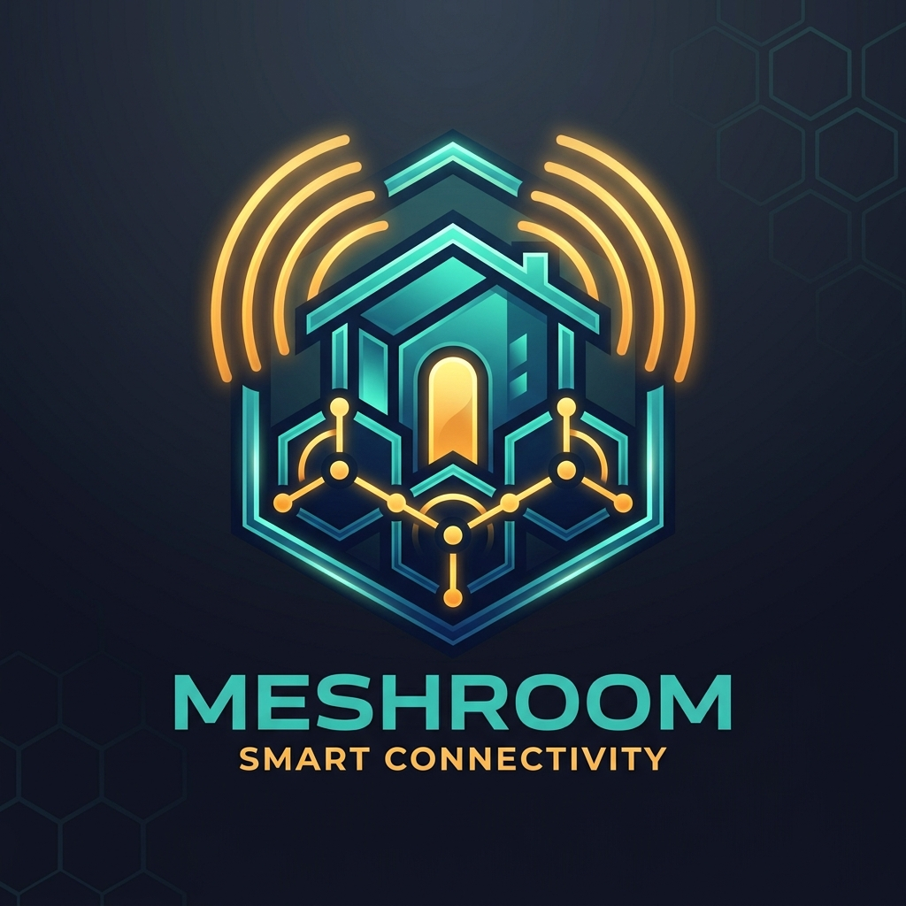

<p align="center">
  
</p>

# MeshRoom

**MeshRoom** is an embedded smart room automation firmware running on Raspberry Pi Pico (RP2040 / RP2350) microcontrollers integrated with [Meshtastic](https://meshtastic.org) LoRa networks under the FreeRTOS SMP kernel. It enables secure, decentralized remote room control, climate automation, television entertainment management, acoustic signaling, and real-time environmental telemetry across off-grid mesh networks.

---

## Key Features

- **Infrared Air Conditioner Control**: Multi-mode AC control (cool, heat, dry, fan, auto) with target temperature adjustments (16°C–30°C), multi-level fan speeds, swing vane angles, and IR blast transmission supporting Panasonic and universal protocols.
- **Infrared Television Control**: Complete remote control for TVs (Sony Bravia, Samsung, Panasonic) including power toggle, discrete volume levels, direct channel tuning, mute toggling, numeric key entry, and video input source cycling.
- **Acoustic Signaling & Morse Code**: Onboard piezo buzzer driving arbitrary audio frequency tones and multi-word text-to-Morse acoustic playback.
- **Environmental & Die Telemetry**: Automatic discovery and reading of I2C temperature, humidity, and atmospheric pressure sensors (BME280 / BMP280) combined with RP2040 internal ADC die temperature sensing.
- **Hardware Paging Button & Alert LED**: Real-time interrupt-driven tactile pushbutton with short/long press threshold detection for mesh-wide broadcast paging and visual alert LED signaling.
- **HomeMesh Auto-Discovery & Machine-Readable Rollcall**: Full compliance with the `HomeMesh` automation protocol, providing structured capability reporting (`rollcall: app=meshroom ver=2.1.4 hw=rp2040 caps=ac_ir,tv_ir,board_temp,buzzer`) for automatic entity discovery in [MeshMon](https://github.com) and Home Assistant.
- **Dual Interactive FreeRTOS Shells**: Concurrent, non-blocking command-line shells on USB CDC serial (`shell0`) and hardware UART0 (`shell1`) for live status queries, hardware diagnostics, and NVM management.
- **Non-Volatile Memory (NVM) Persistence**: Atomic, flash-backed storage for authorized channels, encryption keys, admin/mate access control lists, reset counters, and default IR protocol configurations.
- **FreeRTOS SMP Multitasking**: Pinned dual-core execution on RP2040 with core affinity for TinyUSB CDC communications to prevent silicon concurrency errata.

---

## Hardware Pinout Specifications

| Pin / GPIO | Function | Description |
| :--- | :--- | :--- |
| **GP13** | `PUSHBUTTON_PIN` | Tactile push button (active low, internal pull-up) for broadcast paging. |
| **GP14** | `OUTRESET_PIN` | Output hardware reset signal line. |
| **GP16** | `ALERT_LED_PIN` | Visual status and alert LED indicator. |
| **GP17** | `IR_BLAST_PIN` | 38 kHz infrared transmitter LED driving transistor / MOSFET. |
| **GP22** | `BUZZER_PIN` | Piezo buzzer PWM / tone signal output. |
| **GP0 / GP1** | `UART0_TX` / `UART0_RX` | Hardware UART0 serial console (`115200 8N1`). |
| **GP4 / GP5** | `I2C0_SDA` / `I2C0_SCL` | I2C0 bus for BME280 / BMP280 environmental sensors. |
| **USB CDC** | `TinyUSB` | Native RP2040 USB serial CDC command shell. |

---

## Documentation Index

The `doc/` directory contains protocol and architecture specifications:

| Document | Description |
| :--- | :--- |
| [**`doc/HomeChat-meshroom.md`**](doc/HomeChat-meshroom.md) | Full specification of `meshroom` HomeChat commands (TV, AC, buzzer, Morse code, reset statistics, onboard temperature, and HomeMesh rollcall auto-discovery). |

---

## Building & Flashing

### Prerequisites

- ARM GNU Toolchain (`arm-none-eabi-gcc`, `arm-none-eabi-g++`)
- CMake 3.13+
- Make / Ninja
- Raspberry Pi Pico SDK (`pico-sdk` submodule initialized)

### Compile

```bash
# Standard build
make

# Clean release build (updates version.h)
make release
```

The compiled binaries are generated in `build/`:
- `build/meshroom.uf2`: Drag-and-drop firmware image for Raspberry Pi Pico.
- `build/meshroom.elf`: ELF executable for GDB / OpenOCD debugging.
- `build/meshroom.bin`: Raw binary image.

### Flashing to Hardware

#### Via UF2 Bootloader (USB Mass Storage):
1. Hold the `BOOTSEL` button while plugging the Pico into your host PC.
2. Mount the `RPI-RP2` drive (e.g. at `/mnt/pico`).
3. Run:
   ```bash
   make flash
   ```

#### Via SWD Debug Probe (CMSIS-DAP / Picoprobe):
```bash
# Start OpenOCD GDB server
make openocd

# Reset hardware target via SWD
make openocd-reset

# Connect interactive GDB session
make gdb
```

---

## Quick Start & Shell Usage

Connect to the USB serial console (or hardware UART0) using `minicom`, `screen`, or `picocom`:

```bash
picocom -b 115200 /dev/ttyACM0
```

### Interactive Shell Commands

```text
MeshRoom> help
Available commands:
  status               - Display runtime status and robot channel
  tv [cmd]             - Query or control TV (on, off, vol, chan, mute, input)
  ac [cmd]             - Query or control AC (on, off, temp, mode, fan, vane, blast)
  buzz <freq> <ms>     - Sound piezo buzzer tone
  morse <text>         - Play text in Morse code
  env                  - Print environmental and board temperature
  nodes                - List discovered mesh nodes
  wcfg                 - Display Meshtastic radio configuration
  nvm                  - Inspect or commit NVM flash configuration
  reset                - Display boot and reset statistics
```

---

## HomeMesh Automation Integration

`meshroom` automatically announces itself on the Meshtastic robot channel and registers with [MeshMon](https://github.com) gateways. When `MeshMon` issues a `rollcall` discovery request, `meshroom` reports its active capabilities:

```text
rollcall: app=meshroom ver=2.1.4 hw=rp2040 caps=ac_ir,tv_ir,board_temp,buzzer
```

`MeshMon` automatically provisions corresponding Home Assistant MQTT Auto-Discovery entities:
- **`climate.meshmon_<node>_ac`**: Room AC Climate Control
- **`switch.meshmon_<node>_ac_power`**: AC Power Switch
- **`button.meshmon_<node>_ac_blast`**: AC Force IR Blast Trigger
- **`switch.meshmon_<node>_tv_power`**: TV Power Control
- **`switch.meshmon_<node>_tv_mute`**: TV Mute Control
- **`number.meshmon_<node>_tv_volume`**: TV Volume Slider (0–100)
- **`number.meshmon_<node>_tv_channel`**: TV Channel Selector (1–999)
- **`button.meshmon_<node>_tv_input`**: TV Input Source Selector
- **`sensor.meshmon_<node>_board_temp`**: RP2040 Internal Die Temperature (°C)
- **`sensor.meshmon_<node>_uptime`**: Node Uptime

---

## License & Copyright

Copyright (C) 2026, Charles Chiou. All rights reserved.
